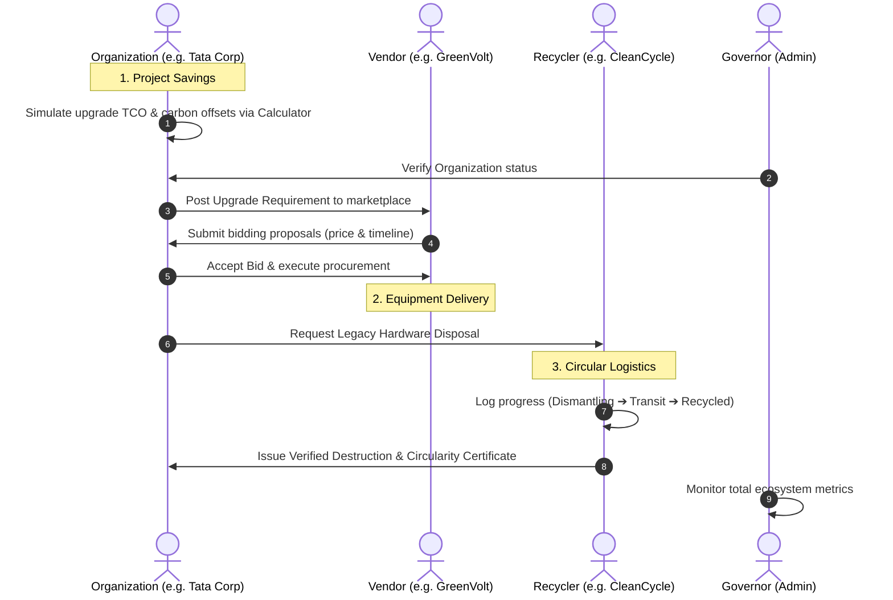
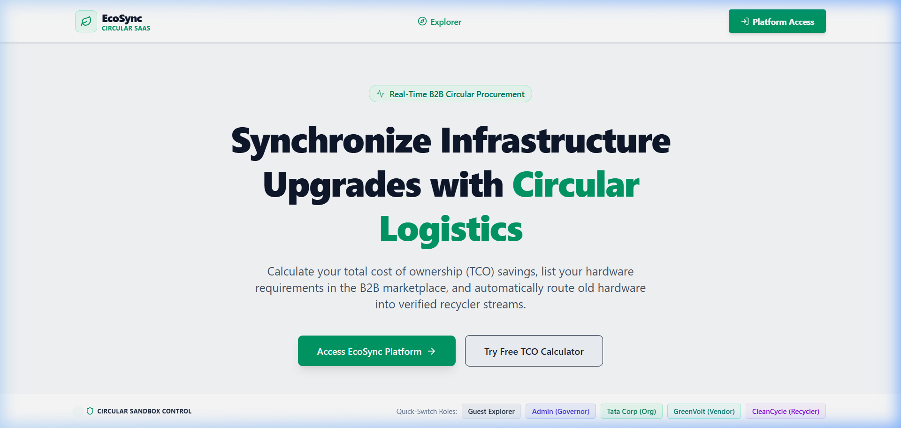
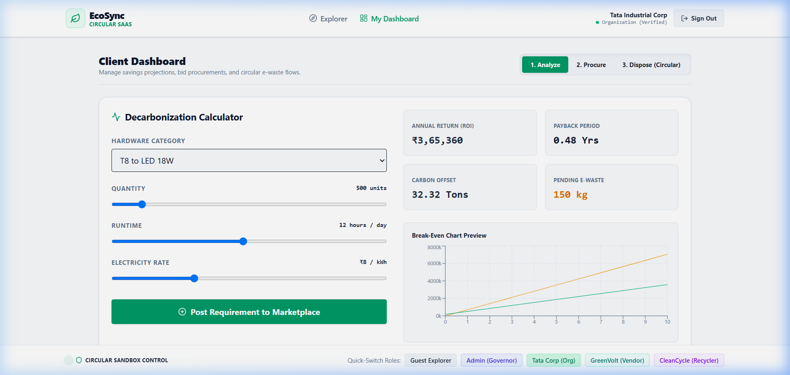
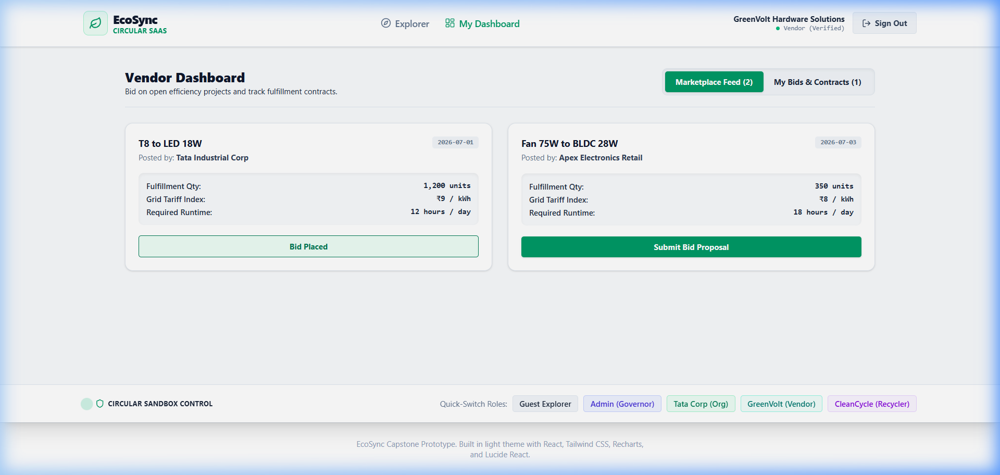
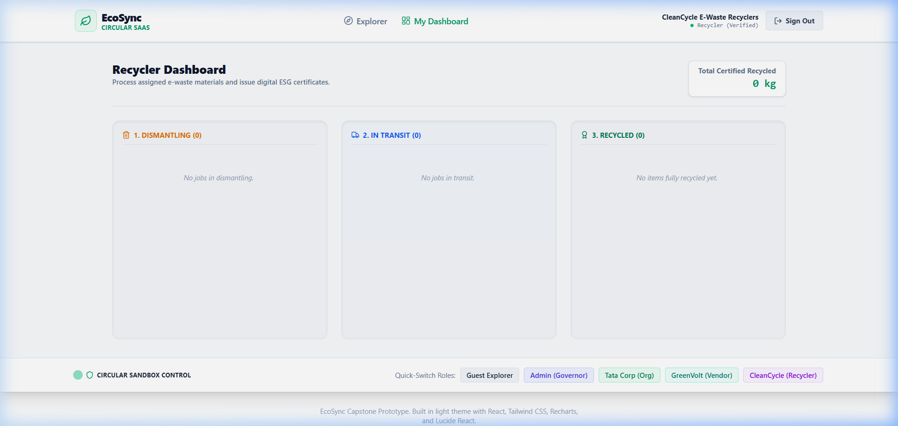
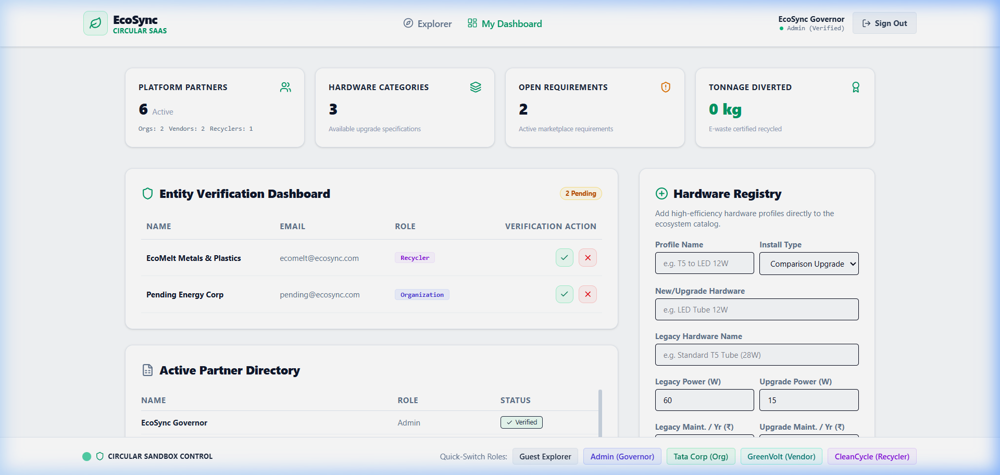

# EcoSync: B2B Decarbonization & Circular Infrastructure Platform

[](https://vite.dev/)
[](https://reactjs.org/)
[](https://www.typescriptlang.org/)
[](https://tailwindcss.com/)
[](LICENSE)

**EcoSync** is a circular B2B SaaS platform designed to synchronize large-scale infrastructure upgrades (such as lighting, cooling, and solar) with green circular logistics. By automating the transition of decommissioned legacy hardware into verified recycling streams, EcoSync helps organizations save costs, minimize e-waste, offset carbon emissions, and guarantee compliance.

---

## 📹 Interactive Demo Walkthrough
Below is an animated walkthrough of the entire end-to-end circular procurement and recycling loop:


---

## 🔁 B2B Circular Procurement Workflow

The core value proposition of EcoSync is its end-to-end circular loop. The lifecycle transitions seamlessly from financial modeling to equipment delivery and verified recycling:



---

## 👥 Ecosystem Roles & Interactive Dashboards

EcoSync includes an integrated role-based layout allowing you to experience the workflows of all ecosystem participants:

### 1. Guest Explorer / Calculator
Prior to accessing the platform, companies can simulate upgrade scenarios.
- **TCO Calculator**: Model operational savings and carbon offsets for specific categories (e.g., standard ceiling fans to BLDC, T8 Fluorescent to LEDs, Solar installation).
- **Live Platform Ribbon**: Showcases total waste diverted, carbon offsets (CO2e), monetary TCO saved, and active partners across the platform.



---

### 2. Tata Corp (Organization / Buyer)
The upgrading entity that drives procurement and tracking:
- **Carbon Accounting Dashboard**: Real-time carbon offset tracker and cumulative TCO savings.
- **Upgrade Center**: Submit new requirements, review incoming bids, and request legacy equipment disposal.
- **Certificate Safe**: Download authenticated circularity certificates for ESG compliance reports.



---

### 3. GreenVolt (Vendor / Supplier)
The hardware vendor supplying clean technology:
- **B2B Marketplace**: View active requirements posted by verified organizations.
- **Quotation/Bid Engine**: Submit unit pricing, delivery schedules, and tracking details.
- **Sales Analytics**: Track accepted quotes and pending bids.



---

### 4. CleanCycle (Recycler / Logistics Partner)
The downstream partner responsible for circular compliance:
- **Disposal Manifest**: Receive decommissioning tasks from fulfilled procurement orders.
- **Lifecycle Tracking**: Log progress (Dismantling ➔ In Transit ➔ Recycled) and calculate exact toxic waste (lead, mercury, plastic) diverted.
- **Circularity Certificates**: Issue cryptographically-verifiable destruction and recycling certificates directly to the organization.



---

### 5. EcoSync Governor (Admin)
The central authority overseeing ecosystem compliance:
- **Ecosystem Registry**: Onboard and verify new Organizations, Vendors, and Recyclers.
- **Global Compliance Ledger**: Track all recycling logs, transaction counts, and ecosystem statistics to prevent greenwashing.



---

## 🛠️ Technology Stack

- **Frontend Framework**: [React 19](https://react.dev/) + [TypeScript](https://www.typescriptlang.org/)
- **Build Tool**: [Vite 8](https://vite.dev/) (with Hot Module Replacement)
- **Styling**: [Tailwind CSS v4](https://tailwindcss.com/)
- **Charts & Visualizations**: [Recharts](https://recharts.org/)
- **Icons**: [Lucide React](https://lucide.dev/)

---

## 🚀 Getting Started

### Prerequisites

Make sure you have [Node.js](https://nodejs.org/) installed (v18+ recommended).

### Installation

1. Clone the repository:
   ```bash
   git clone https://github.com/shiva0128/ECOSYNC.git
   cd ECOSYNC
   ```

2. Install dependencies:
   ```bash
   npm install
   ```

3. Run the development server:
   ```bash
   npm run dev
   ```
   Open `http://localhost:5173/` in your browser.

4. To build the project:
   ```bash
   npm run build
   ```
   This generates a production-ready bundle in the `dist` directory.
